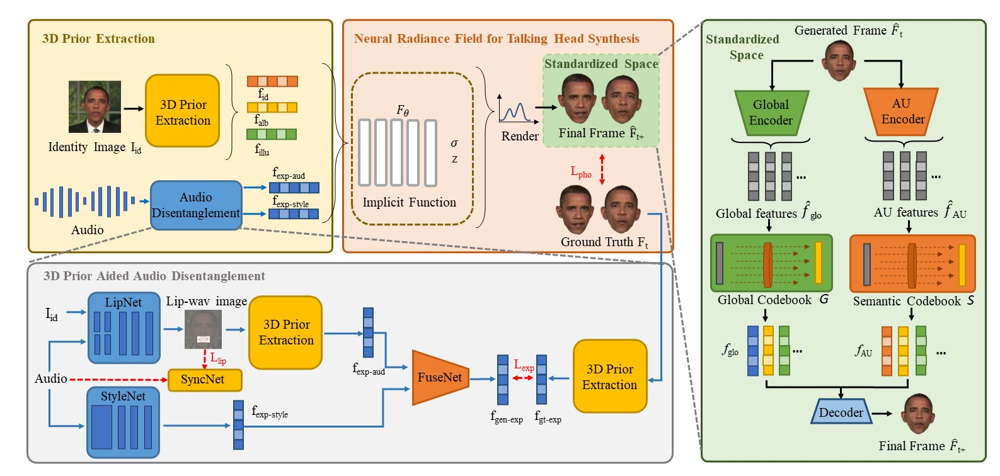
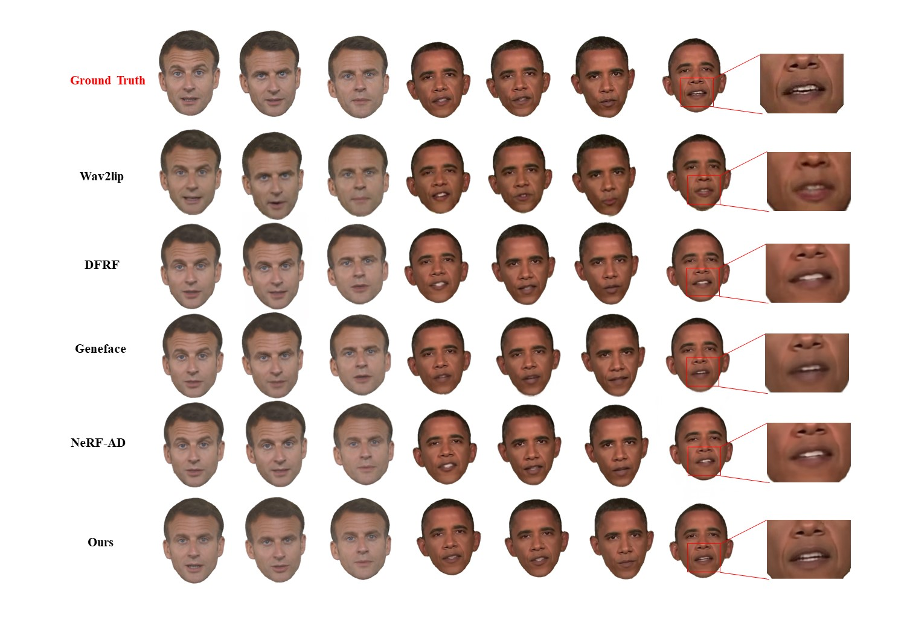
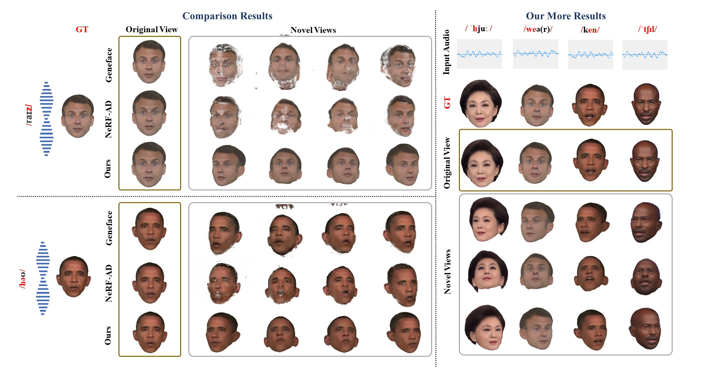

# NeRF-3DTalker: Neural Radiance Field with 3D Prior Aided Audio Disentanglement for Talking Head Synthesis

## Video--Original view in datasets
---

<video style="width: 100%; height: 100%; margin: 0 auto;" controls>
  <source src="he3.mp4" type="video/mp4">
  Your browser does not support the video tag.
</video>
## Novel Views
---

    

        
    

Talking heads generated by other methods are only clear when the views closely approximate the frontal view or when the views are present in the dataset. As the angle diverges significantly, a sense of fragmentation emerges. In contrast, our approach integrates 3D prior knowledge and 3D Prior Aided Audio Disentanglement module, enabling the neural radiance field to reconstruct crisp 3D talking head features.

## Abstract & Method
---

  Talking head synthesis is to synthesize a lip-synchronized talking head video using audio. Recently, the capability of NeRF to enhance the realism and texture details of synthesized talking heads has attracted the attention of researchers. However, most current NeRF methods based on audio are exclusively concerned with the rendering of frontal faces. These methods are unable to generate clear talking heads in novel views. Another prevalent challenge in current 3D talking head synthesis is the difficulty in aligning acoustic and visual spaces, which often results in suboptimal lip-syncing of the generated talking heads. To address these issues, we propose Neural Radiance Field with 3D Prior Aided Audio Disentanglement for Talking Head Synthesis (NeRF-3DTalker). Specifically, the proposed method employs 3D prior information to synthesize clear talking heads with free views. Additionally, we propose a 3D Prior Aided Audio Disentanglement module, which is designed to disentangle the audio into two distinct categories: features related to 3D awarded speech movements and features related to speaking style. Moreover, to reposition the generated frames that are distant from the speaker's motion space in the real space, we have devised a local-global Standardized Space. This method normalizes the irregular positions in the generated frames from both global and local semantic perspectives. Through comprehensive qualitative and quantitative experiments, it has been demonstrated that our NeRF-3DTalker outperforms state-of-the-art in synthesizing realistic talking head videos, exhibiting superior image quality and lip synchronization.

## Results
---

## More Results
---

  

